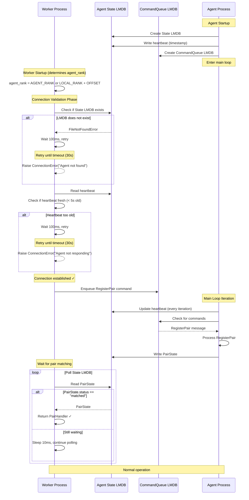

# Worker-Agent Connection Validation

## Overview

This document describes the connection validation mechanism between Worker processes and Agent processes in the Tensor Bus system.

**Design Level**: Level 1 - Basic Validation + Error Handling

**Philosophy**: Simple, robust, following the KISS principle. Approximately 20 lines of core code.

## Problem Statement

Workers and Agents run in separate process groups (launched by separate torchrun invocations). The connection challenges:

1. **Agent Existence**: How does Worker know the Agent exists and is running?
2. **Connection Verification**: How to detect if Agent has crashed or is unresponsive?
3. **Error Handling**: How to provide friendly error messages when connection fails?
4. **Path Correctness**: How to detect if Worker is trying to connect to wrong agent_rank?

## Architecture

### Communication Channels

```
Worker → Agent: CommandQueue LMDB (commands)
Agent → Worker: State LMDB (pair states + heartbeat)
```

### Data Structure

Agent maintains heartbeat in State LMDB:

```python
# State LMDB keys
b"agent:heartbeat" -> b"1234567890.123"  # Unix timestamp
b"pair:{name}:state" -> msgpack(PairState)  # Existing pair states
```

## Connection Flow



## Implementation

### Agent Side: Heartbeat Mechanism

**File**: `src/etha/tensor_bus/agent.py`

```python
class TensorBusAgent:
    def __init__(self, ..., lmdb_state_path: str | None = None):
        # ... existing initialization ...

        if lmdb_state_path:
            self.state_env = lmdb.open(lmdb_state_path, ...)
            self.state_db = self.state_env.open_db(b"pair_state")

            # Write initial heartbeat
            self._update_heartbeat()
            logger.info(f"Agent {rank}: Initial heartbeat written")

    def run(self):
        """Main loop: update heartbeat and process commands."""
        while True:
            # Update heartbeat every iteration (~1ms interval)
            self._update_heartbeat()

            # Process commands from CommandQueue
            if self.command_queue.size() != 0:
                msg = self.command_queue.dequeue()
                if msg is not None:
                    self._handle_command(msg)

            time.sleep(0.001)

    def _update_heartbeat(self):
        """Write current timestamp to State LMDB."""
        if self.state_env and self.state_db:
            with self.state_env.begin(write=True, db=self.state_db) as txn:
                txn.put(b"agent:heartbeat", str(time.time()).encode())
```

### Worker Side: Connection Validation

**File**: `src/etha/tensor_bus/client.py`

```python
class TensorBusClient:
    def __init__(
        self,
        lmdb_command_queue_path: str,
        agent_state_lmdb_path: str,
    ):
        # Phase 1: Validate Agent is running
        self._validate_agent_connection(agent_state_lmdb_path, timeout=30.0)

        # Phase 2: Open connections (safe now)
        self.state_env = lmdb.open(agent_state_lmdb_path, readonly=True, ...)
        self.state_db = self.state_env.open_db(b"pair_state")
        self.command_queue = CommandQueue(lmdb_command_queue_path)

    def _validate_agent_connection(self, path: str, timeout: float):
        """Validate Agent is running and responsive.

        Checks:
        1. LMDB file exists
        2. Heartbeat is fresh (< 5 seconds old)

        Raises:
            ConnectionError: Agent not found or not responding
        """
        start_time = time.time()

        # Step 1: Wait for LMDB file to exist
        while not os.path.exists(path):
            if time.time() - start_time > timeout:
                raise ConnectionError(
                    f"Agent LMDB not found at {path}. "
                    f"Please ensure Agent process is running. "
                    f"Check AGENT_RANK environment variable."
                )
            time.sleep(0.1)

        # Step 2: Verify heartbeat is fresh
        env = lmdb.open(path, readonly=True, lock=False, subdir=False, max_dbs=2)
        db = env.open_db(b"pair_state")

        while True:
            with env.begin(db=db) as txn:
                heartbeat_bytes = txn.get(b"agent:heartbeat")
                if heartbeat_bytes:
                    heartbeat_time = float(heartbeat_bytes.decode())
                    age = time.time() - heartbeat_time

                    if age < 5.0:  # Heartbeat is fresh
                        env.close()
                        logger.info(f"Agent connection validated (heartbeat age: {age:.2f}s)")
                        return  # Success!

            if time.time() - start_time > timeout:
                env.close()
                raise ConnectionError(
                    f"Agent at {path} is not responding. "
                    f"Heartbeat age > 5s. Agent may have crashed."
                )

            time.sleep(0.1)
```

## Error Scenarios

| Scenario | Detection | Error Message | Resolution |
|----------|-----------|---------------|------------|
| **Agent not started** | LMDB file missing | `ConnectionError: Agent LMDB not found at /tmp/agent_rank0_state.lmdb. Please ensure Agent process is running.` | Start Agent process first |
| **Agent crashed** | Heartbeat too old (> 5s) | `ConnectionError: Agent at /tmp/agent_rank0_state.lmdb is not responding. Heartbeat age > 5s. Agent may have crashed.` | Restart Agent process |
| **Wrong AGENT_RANK** | LMDB path incorrect | `ConnectionError: Agent LMDB not found at /tmp/agent_rank99_state.lmdb. Check AGENT_RANK environment variable.` | Fix AGENT_RANK value |
| **LMDB permission error** | Open fails | LMDB exception with file permissions | Fix file permissions |

## Configuration

### Environment Variables

```bash
# Worker side: Specify which Agent to connect to
AGENT_RANK=0  # Direct specification (priority 1)
# OR
AGENT_RANK_OFFSET=0  # Offset-based calculation (priority 2)
LOCAL_RANK=0  # From torchrun
```

## Benefits

✅ **Simple**: ~20 lines of core code, minimal complexity
✅ **Robust**: Covers Agent not found, crashed, wrong path scenarios
✅ **Friendly**: Clear error messages with actionable guidance
✅ **Zero overhead**: Heartbeat updates reuse main loop, no extra threads
✅ **Non-intrusive**: No changes to existing RegisterPair protocol

## Limitations (Future Work - Level 2)

This Level 1 design does NOT prevent:

❌ **Multiple Workers connecting to same Agent**: No mutual exclusion mechanism
❌ **Agent tracking connected Workers**: Agent doesn't know who's connected
❌ **Automatic reconnection**: No recovery from connection loss during operation

These features require Level 2 implementation:
- Explicit Connect/ACK handshake protocol
- Connection state machine
- Worker identity registration in Agent

## Testing

### Test Cases

```python
# Test 1: Agent not running
AGENT_RANK=0 python worker.py
# Expected: ConnectionError after 30s timeout

# Test 2: Agent crashes after connection
# - Start Agent
# - Worker connects successfully
# - Kill Agent
# - Worker's next operation should detect stale heartbeat

# Test 3: Wrong AGENT_RANK
AGENT_RANK=99 python worker.py  # No such Agent
# Expected: ConnectionError with clear message

# Test 4: Normal operation
# - Start Agent rank 0
# - Start Worker with AGENT_RANK=0
# Expected: Connection succeeds, heartbeat validated
```

### Manual Testing

```bash
# Terminal 1: Start Agent
torchrun --nproc_per_node=8 prototyping/pair_registration_demo/agent.py

# Terminal 2: Try to connect before Agent is ready
AGENT_RANK=0 python -c "from etha.tensor_bus import TensorBusClient; ..."
# Should retry and eventually succeed

# Terminal 3: Connect to non-existent Agent
AGENT_RANK=99 python -c "from etha.tensor_bus import TensorBusClient; ..."
# Should fail with clear error after timeout
```

## References

- Bootstrap mechanism: `docs/bootstrap-mechanism.md` (convention-based path naming)
- CommandQueue implementation: `src/etha/tensor_bus/command_queue.py`
- Agent implementation: `src/etha/tensor_bus/agent.py`
- Client implementation: `src/etha/tensor_bus/client.py`
