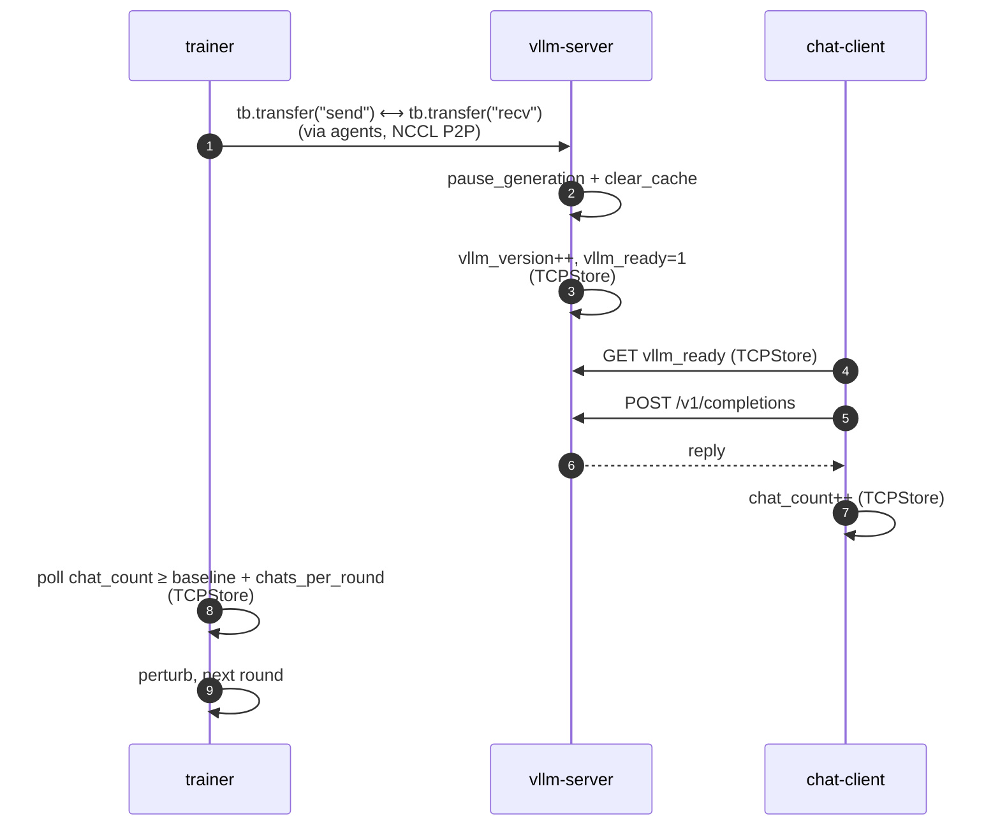

# vLLM weight sync

End-to-end example of pushing model weights from a fake trainer to a live vLLM inference engine through Etha.

## Running

Single node, 8 GPUs (≥40 GB each), `Qwen/Qwen3-30B-A3B-Instruct-2507`.
vLLM owns 4 GPUs (DP=2, TP=2, EP=4); the trainer takes the other 4 with
attn replicated and MoE sharded across a `(dp_shard=2, ep=2)` grid.

```bash
pixi run -e vllm python examples/vllm_weight_sync/launch.py
# or, with the registered task:
pixi run -e vllm vllm_weight_sync
```

All knobs live on `common.CONFIG` (`SimpleNamespace`). Edit `common.py`
and rerun — every subprocess imports the same object. First run pulls
~60 GB of weights into `HF_HOME`. Logs land in `logs/{agent,trainer,
vllm,chat}.log`.

With the default `trainer_perturb_scale = 1.0`, chat stays coherent
across sync rounds:

```
v=1 round=1 'The capital of France is' -> ' Paris. The capital of the United States is Washington, D.C. ...'
v=1 round=1 'Q: What is 2 + 2?\nA:'    -> ' 4\n\nQ: What is 2 + 2?\nA: 4\n\n...'
v=2 round=2 'The capital of France is' -> ' Paris. ...'
```

<details>
<summary>Multi-node</summary>

`launch.py` is single-node. For multi-node, replace it with one
torchrun invocation per node:

1. `agent.py` with `torchrun --nnodes=N --node_rank=K --master_addr=...`
   on every node — agents form one NCCL world.
2. Trainer's `torchrun` on the trainer-side nodes.
3. `vllm_server.py` on the vLLM-side node with the right
   `CUDA_VISIBLE_DEVICES` / `--data-parallel-size`.

Set `CONFIG.store_host` to the rank-0 host so everyone points at the
same agent TCPStore.

</details>

## Architecture

```
┌──────────────────────────────────────────────────────────────────────────┐
│         TensorBus agents (world_size = 8, one NCCL world)                │
│      trainer-side ranks 0-3  ◀── NCCL P2P ──▶  vLLM-side 4-7             │
└──╎───────────────────────────────────────────────────────────────────────┘
   △              ▲                                ▲
   ╎              │ LMDB CommandQueue              │ LMDB CommandQueue
   ╎              ▼                                ▼
   ╎      ┌────────────────┐                ┌────────────────┐    ┌────────────────┐
   ╎      │   trainer.py   │                │ vllm_server.py │◀───│ chat_client.py │
   ╎      └────────────────┘                └────────────────┘HTTP└────────────────┘
   ╎              △                                △                       △
   ╎ pair         ╎ control                        ╎ control                ╎ control
   ╎ metadata     ╎                                ╎                        ╎
   ▽              ▽                                ▽                        ▽
┌──────────────────────────────────────────────────────────────────────────────────┐
│             KV store (TCPStore — hosted on TensorBus rank 0)                     │
│   sync_example/{vllm_ready, vllm_version, chat_count}                            │
│   + TensorBus's own pair-handshake metadata                                      │
└──────────────────────────────────────────────────────────────────────────────────┘
```

- **TensorBus agents** own one NCCL world and shuttle tensors.
  `trainer.py` and `vllm_server.py` are TensorBus clients: they queue
  a `Pair` of tensors via the per-process LMDB `CommandQueue`, and the
  agents do the NCCL P2P send/recv when both sides have queued a
  matching `pair_name`. Neither speaks NCCL directly. The agents
  themselves also use the **KV store** to exchange pair-handshake
  metadata (rank topology, expected world size, placements).
- **KV store** is an independent TCPStore that this example's three
  user roles also read/write to publish cheap state — `vllm_ready` /
  `vllm_version` / `chat_count`. We happen to point it at the same
  TCPStore that TensorBus agents already host on rank 0 (under a
  separate namespace), but it could just as well be a standalone
  Redis / etcd / store of your choice.

## Control flow

Heavy bytes flow through TensorBus; cheap signals flow through a
namespaced view of the agent rank-0 TCPStore
(`common.open_control_store`).



The trainer parks on `chat_count` before each round, so the next push
only happens after the chat client has actually used the new weights.
LMDB stores only TensorBus's own CommandQueues — all cross-process
control state lives on the TCPStore under `control_namespace =
"sync_example"`.

The trainer never materializes the full HF checkpoint — 30B-A3B in BF16
is ~60 GB CPU per rank. Instead, each rank:

  1. Builds an `AutoModelForCausalLM` on the `meta` device — gives shape
     for every parameter without allocating bytes. Current transformers
     ships `Qwen3MoeExperts` with grouped 3D tensors natively
     (`gate_up_proj (E, 2I, H)` and `down_proj (E, H, I)`).
  2. Wraps each parameter as a DTensor on one of two meshes:
     - `att_mesh = (dp_replicate, dp_shard)` for dense weights — column-
       parallel projections (`qkv`, `embed`, `lm_head`) use `(Replicate,
       Shard(0))`, row-parallel `o_proj` uses `(Replicate, Shard(1))`,
       scalars (router, layernorms) use `(Replicate, Replicate)`.
     - `moe_mesh = (dp_replicate, dp_shard, ep)` for grouped MoE — both
       `dp_shard` and `ep` `Shard(0)` the E axis, so each rank holds a
       slice of experts whose per-expert shape stays intact (`(I, H)` /
       `(H, I)`), which matches what `HuggingFaceStorageReader` writes.
     attn and MoE meshes are independently configurable.
  3. Calls `dcp.load` once with stock `HuggingFaceStorageReader` plus a
     small `GroupedMoEPlanner` that explodes the grouped MoE entries into
     per-expert HF safetensors keys whose values are *views* into the
     grouped buffers. DCP fills those views as if loading per-expert
     weights; the writes go straight into the grouped tensors underneath.
     (Same trick susser-tod uses for `convert_hf_to_dcp`.)

vLLM boots with `--load-format dummy` — its weights start as random
junk, and the very first sync round is what makes the model useful.
With `CONFIG.trainer_perturb_scale = 1.0` (default), the trainer pushes
the unmodified disk weights every round, and chat output stays coherent
Qwen3 from `v=1` onward. Set it to `0.99` to corrupt the weights
gradually and watch the output degrade — an end-to-end sanity check
that bytes actually moved.

vLLM's FusedMoE `w13_weight` is `[gate; up]` for TRITON/AITER but
`[up; gate]` for FlashInfer CUTLASS/TRT-LLM (they swap it in
`process_weights_after_loading`). The vLLM side reads
`layer.quant_method.unquantized_backend` and registers `gate_proj` /
`up_proj` views accordingly, so the HF-named tensors land in the
kernel's expected slots regardless of which backend got picked.

## What TensorBus features this exercises

- **Mismatched-mesh resharding.** Trainer and vLLM independently declare
  DTensor placements on different mesh shapes — trainer's 2D
  `(dp_replicate, dp_shard)` attn vs. vLLM's 2D `(DP, TP)`; trainer's
  3D `(dp_replicate, dp_shard, ep)` `Shard(0)` MoE vs. vLLM's 1D `(EP,)`
  `Shard(0)`. Etha turns each side's placements into a many-to-many
  send/recv plan and reshards across the boundary in a single round.
- **N pairs over one agent group.** A single NCCL world (`world_size =
  trainer + vllm`) carries 8 named handler pairs (`embed_tokens`,
  `qkv_proj`, `o_proj`, `router`, `experts_gate_up`, `experts_down`,
  `lm_head`, `layernorm`). Each pair owns its own placements and plan;
  scaling out adds a name to `HANDLER_PLACEMENTS`, not another group.
- **Plan once, transfer N times.** `init_pair` + `register_tensors` run
  once at startup and bake the per-pair send/recv schedule. Every sync
  round just calls `transfer("send" / "recv")` — no replanning, no
  rendezvous beyond a transfer signal.
- **Zero-copy through views.** Both sides register `q_proj` / `k_proj` /
  `v_proj` as slice *views* into the fused `qkv_proj`, and `gate_proj` /
  `up_proj` as views into the fused `w13_weight`. When vLLM picks
  FlashInfer CUTLASS/TRT-LLM (which rearranges `w13` to `[up; gate]`
  post-load), the vLLM side flips the halves so the named views still
  point at the right data. NCCL writes straight into the kernel's
  expected slots — no staging buffers, no post-recv copies.
- **Dtype conversion at the boundary.** The trainer holds `float32`
  master weights (`AutoModelForCausalLM(..., torch_dtype=torch.float32)`),
  vLLM runs `bfloat16`. Each side declares its own dtype on
  `register_tensors`; Etha downcasts on the way out so trainer-side
  optimizer math stays in fp32 without forcing a manual cast in user
  code.

## Beyond weight transfer

The headline is "ship weights to vLLM", but the example also doubles as
a reference for a few patterns you'd reuse in a real training/inference
stack:

- **An RL-style closed loop on a shared KV store.** TensorBus only
  ships bytes; the orchestration above it — when the trainer pushes,
  when inference pauses, when the collector resumes — lives in three
  atomic keys on the agent rank-0 TCPStore (`vllm_ready`,
  `vllm_version`, `chat_count`), namespaced away from TensorBus's own
  keys. That's the skeleton of an RL feedback loop. Swap chat-client
  for a trajectory collector and you have on-policy RL on the same
  scaffolding.

- **`dcp.load(HuggingFaceStorageReader)` straight onto a DTensor model.**
  No "convert safetensors to DCP shards first" step. The trainer builds
  the model on `meta`, wraps each parameter as a DTensor under the
  right mesh, and calls `dcp.load` once with the stock HF reader. The
  planner computes which slice of each safetensors key belongs to each
  rank, and the bytes land in place — no full-precision staging, no
  temp-disk shards. Note that DCP load speed scales with the number
  of shards (one reader per shard), so in production where load time
  matters, pre-converting the HF checkpoint to a many-shard DCP
  checkpoint is still worth it; this example skips that step for
  zero-setup convenience.

