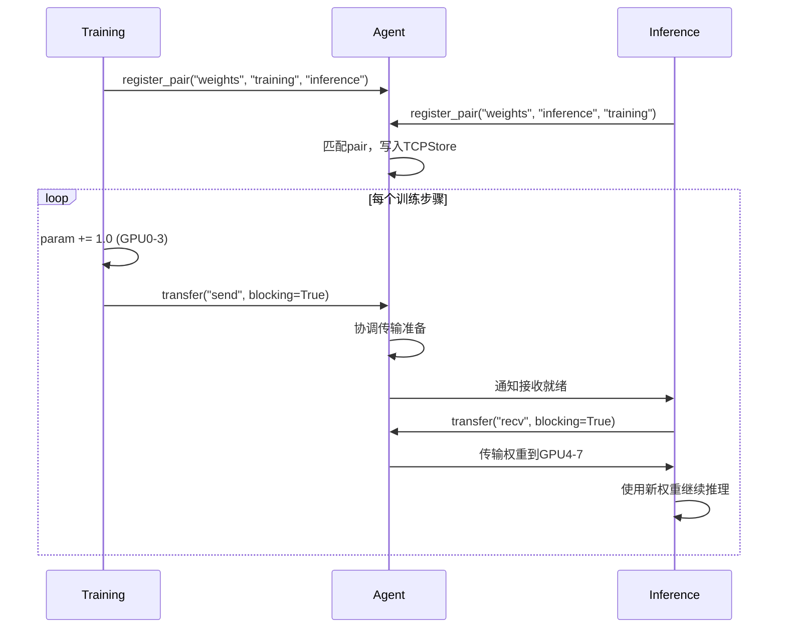

# TensorBus Weight Transfer - 分布式训练推理权重同步系统

这是一个基于 TensorBus 架构的分布式权重传输原型系统，实现了训练进程和推理进程之间的零拷贝张量同步。

## 🏗️ 系统架构

### 三层架构设计
```
┌─────────────────────────────────────────────────────────────┐
│                    训练层 (GPU 0-3)                          │
│  ┌─────────┐ ┌─────────┐ ┌─────────┐ ┌─────────┐          │
│  │Train R0 │ │Train R1 │ │Train R2 │ │Train R3 │          │
│  │ GPU:0   │ │ GPU:1   │ │ GPU:2   │ │ GPU:3   │          │
│  └────┬────┘ └────┬────┘ └────┬────┘ └────┬────┘          │
│       │           │           │           │               │
│       ▼           ▼           ▼           ▼               │
│  TensorBusClient TensorBusClient TensorBusClient TensorBusClient
│       │           │           │           │               │
└───────┼───────────┼───────────┼───────────┼─────────────────┘
        │           │           │           │
        ▼           ▼           ▼           ▼
┌───────┴───────────┴───────────┴───────────┴─────────────────┐
│                    Agent 协调层 (GPU 0-7)                     │
│  ┌─────────┐ ┌─────────┐ ┌─────────┐ ┌─────────┐ ┌─────────┐ │
│  │Agent R0 │ │Agent R1 │ │Agent R2 │ │Agent R3 │ │Agent R4 │ │
│  │ GPU:0   │ │ GPU:1   │ │ GPU:2   │ │ GPU:3   │ │ GPU:4   │ │
│  └────┬────┘ └────┬────┘ └────┬────┘ └────┬────┘ └────┬────┘ │
│       │           │           │           │           │      │
│       ▼           ▼           ▼           ▼           ▼      │
│  ┌─────────┐ ┌─────────┐ ┌─────────┐ ┌─────────┐ ┌─────────┐ │
│  │Agent R5 │ │Agent R6 │ │Agent R7 │ │LMDB存储 │ │TCPStore │ │
│  │ GPU:5   │ │ GPU:6   │ │ GPU:7   │ │状态管理 │ │协调服务 │ │
│  └─────────┘ └─────────┘ └─────────┘ └─────────┘ └─────────┘ │
└──────────────────────────────────────────────────────────────┘
        ▲           ▲           ▲           ▲
        │           │           │           │
┌───────┼───────────┼───────────┼───────────┼─────────────────┐
│       │           │           │           │                 │
│  TensorBusClient TensorBusClient TensorBusClient TensorBusClient
│       ▲           ▲           ▲           ▲                 │
│       │           │           │           │                 │
│  ┌─────────┐ ┌─────────┐ ┌─────────┐ ┌─────────┐          │
│  │Infer R0 │ │Infer R1 │ │Infer R2 │ │Infer R3 │          │
│  │ GPU:4   │ │ GPU:5   │ │ GPU:6   │ │ GPU:7   │          │
│  └─────────┘ └─────────┘ └─────────┘ └─────────┘          │
│                    推理层 (GPU 4-7)                          │
└──────────────────────────────────────────────────────────────┘
```

### 核心组件

| 组件 | 进程数 | GPU分配 | 主要职责 |
|------|--------|---------|----------|
| **Agent** | 8 | cuda:0-7 | 协调服务、命令队列、状态管理 |
| **Training** | 4 | cuda:0-3 | 模型训练、权重更新、发送权重 |
| **Inference** | 4 | cuda:4-7 | 模型推理、接收权重、继续推理 |

## 🚀 快速开始

### 一键启动
```bash
# 清理并启动所有组件
./prototyping/weight_transfer/launch.sh
```

### 分步启动（调试用）
```bash
# 终端1: 启动Agent协调服务（8进程）
pixi run torchrun --nproc_per_node=8 --master-port=29500 \
  prototyping/pair_registration_demo/agent.py

# 终端2: 启动训练Worker（4进程）
pixi run torchrun --nproc_per_node=4 --master-port=29501 \
  prototyping/weight_transfer/train.py

# 终端3: 启动推理Worker（4进程，连接Agent 4-7）
AGENT_RANK_OFFSET=4 pixi run torchrun --nproc_per_node=4 --master-port=29502 \
  prototyping/weight_transfer/inference.py
```

## 🔧 核心实现

### 训练Worker (`train.py`)
```python
class Trainer:
    def optimizer_step(self, step: int):
        self.param += 1.0  # 模拟参数更新

        # 每步发送权重到推理端
        handler.transfer("send", blocking=False)
```

**关键特性**:
- ✅ 自动设备分配：`cuda:{local_rank}`
- ✅ Pair注册：`training -> inference`
- ✅ 阻塞式传输：确保权重送达
- ✅ 信号量同步：防止竞态条件

### 推理Worker (`inference.py`)
```python
class InferenceEngine:
    def step(self):
        # 检查是否有新权重
        status = client.query_transfer_signal(PAIR_NAME)
        if status == True:
            engine.stop()
            handler.transfer(transfer_type="recv", blocking=True)
            engine.resume()
        engine.step()
```

**关键特性**:
- ✅ 自动连接Agent 4-7（通过AGENT_RANK_OFFSET）
- ✅ Pair注册：`inference -> training`
- ✅ 非阻塞接收：避免推理中断
- ✅ 权重热更新：零停机时间

### Agent协调 (`agent.py`)
```python
def _handle_transfer(self, msg: Transfer):
    # 1. 设置传输就绪标志
    # 2. 等待所有rank准备就绪
    # 3. 执行NCCL点对点传输（TODO）
    # 4. 释放信号量，通知完成
```

**关键特性**:
- ✅ 8进程并行协调
- ✅ TCPStore状态管理
- ✅ LMDB命令队列
- ✅ 信号量同步机制

## 📊 数据流分析

### 权重传输流程


### 技术栈
- **分布式协调**: PyTorch TCPStore + LMDB
- **进程通信**: POSIX信号量 + 命令队列
- **张量序列化**: ForkingPickler（零拷贝潜力）
- **后端传输**: NCCL（TODO：当前为模拟）
- **设备管理**: CUDA自动分配

## 📊 运行日志展示

### 训练Worker日志
```
[19:59:14] [Training Worker 189282] [INFO] [train rank=0] step=0 value=1.0 device=cuda:0
[19:59:22] [Training Worker 189282] [INFO] [train rank=0] step=1 value=2.0 device=cuda:0
[19:59:34] [Training Worker 189282] [INFO] [train rank=0] step=2 value=3.0 device=cuda:0
[19:59:45] [Training Worker 189282] [INFO] [train rank=0] step=3 value=4.0 device=cuda:0
[19:59:56] [Training Worker 189282] [INFO] [train rank=0] step=4 value=5.0 device=cuda:0
[20:00:07] [Training Worker 189282] [INFO] [train rank=0] step=5 value=6.0 device=cuda:0
```

### 推理Worker日志
```
[19:59:14] [Inference Worker 189277] [INFO] [inference rank=0] step value=0.0 device=cuda:4
[19:59:16] [Inference Worker 189277] [INFO] [inference rank=0] stop inference
[19:59:25] [Inference Worker 189277] [INFO] [inference rank=0] resume inference
[19:59:27] [Inference Worker 189277] [INFO] [inference rank=0] step value=1.0 device=cuda:4
[19:59:29] [Inference Worker 189277] [INFO] [inference rank=0] stop inference
[19:59:36] [Inference Worker 189277] [INFO] [inference rank=0] resume inference
[19:59:38] [Inference Worker 189277] [INFO] [inference rank=0] step value=2.0 device=cuda:4
[19:59:40] [Inference Worker 189277] [INFO] [inference rank=0] stop inference
[19:59:47] [Inference Worker 189277] [INFO] [inference rank=0] resume inference
[19:59:49] [Inference Worker 189277] [INFO] [inference rank=0] step value=3.0 device=cuda:4
```

### 权重传输流程分析
从日志可以看出：
1. **训练端**：每步增加1.0，从1.0 → 2.0 → 3.0...（GPU 0）
2. **推理端**：初始值0.0，接收权重后变为1.0 → 2.0 → 3.0...（GPU 4）
3. **同步机制**：`stop inference` → `resume inference` 显示权重传输的暂停/恢复过程
4. **设备分配**：训练使用cuda:0，推理使用cuda:4，符合预期架构

**关键观察**：推理端的值比训练端滞后一步，这是预期的行为，因为需要完成一次传输后才能获取新权重。

## ⚠️ 已知问题

### GPU设备分配问题
**现象**: `NCCL error: Duplicate GPU detected`
**原因**: bootstrap时需要设置torch.cuda.device(agent_rank)

### 实际传输TODO
**当前**: 使用`time.sleep(5)`模拟传输延迟
**目标**: 集成NCCL点对点`send`/`recv`

## 📁 项目结构

```
prototyping/weight_transfer/
├── agent.py              # Agent进程入口（复用）
├── train.py              # 训练Worker实现
├── inference.py          # 推理Worker实现
├── launch.sh             # 统一启动脚本
├── shared.py             # 共享常量和路径
├── logs/                 # 日志输出目录
├── dbs/                  # LMDB数据库目录
└── README.md             # 本文档
```